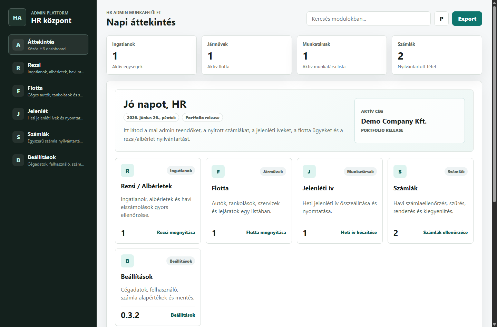
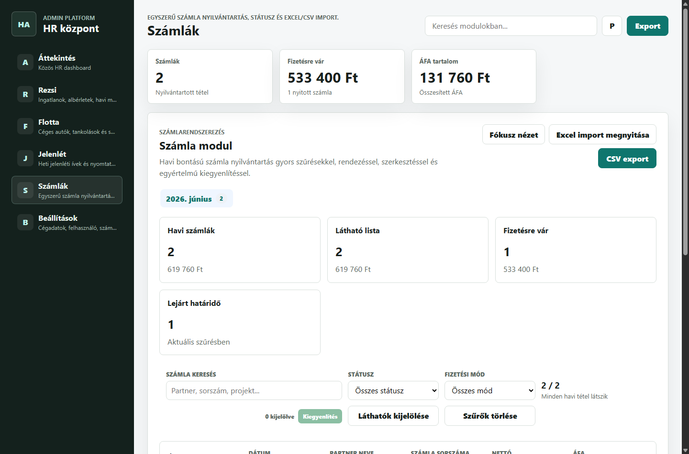
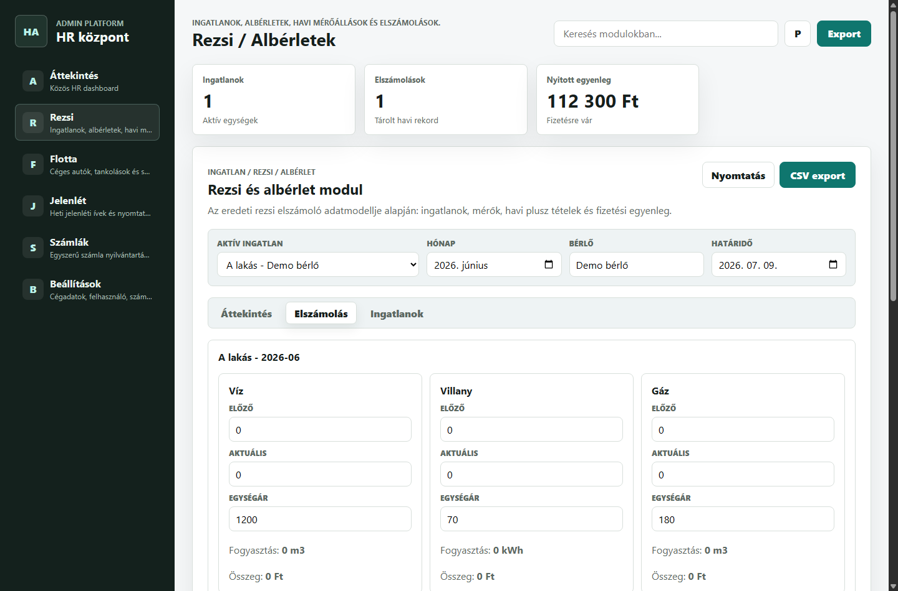

# HR Admin Platform


HR Admin Platform is a local-first Windows desktop application for small business administration workflows: invoices, fleet records, attendance sheets, utilities/rent settlements, and basic company settings.

## Portfolio Context

This project is presented as a practical IT operations portfolio piece for remote Junior System Administrator / IT Support Engineer roles. It focuses on the full lifecycle around an internal business tool: packaging, Windows deployment, release assets, local data storage, backup/restore, security boundaries, and user-facing documentation.

It is not only a UI project. The repository demonstrates how an internal desktop app can be prepared for handoff: assisted installer builds, release/demo modes, checksum generation, deployment notes, security limitations, and GitHub Actions automation.

## What This Demonstrates

- Windows desktop packaging with a classic NSIS setup wizard.
- Local-first data handling with optional NAS/shared JSON file mode.
- Release/demo build separation and SHA256 checksums.
- Backup, restore, deployment, security, and workflow documentation.
- Portfolio-style GitHub process: issues, pull requests, milestones, and releases.

## Features

- **Invoice administration**: manual entry, CSV import, saved partners, project hints, focus view, filtering, and bulk settlement.
- **Fleet management**: vehicles, refuels, service jobs, cost summaries, and MOT/insurance deadlines.
- **Utilities / rent settlements**: properties, tenants, utility meter readings, monthly balances, and one-off extra items.
- **Attendance sheets**: employee list, weekly sheet preview, A4 print workflow, and CSV export.
- **Settings and backup**: company/user defaults, invoice defaults, local/shared data file mode, backup, and restore.

## Screenshots

The screenshots below use the release build with empty/sanitized data.

| Overview | Invoices | Utilities / Rent |
| --- | --- | --- |
|  |  |  |

## Architecture and Tech Stack

- **Runtime**: Electron desktop app for Windows.
- **Frontend**: static HTML, CSS, and vanilla JavaScript modules.
- **Storage**: local JSON data file through Electron preload/native IPC, with browser localStorage fallback for development.
- **Packaging**: electron-builder with NSIS assisted installer.
- **Build modes**: release mode starts empty; demo mode seeds fictional sample data.

See [docs/ARCHITECTURE.md](docs/ARCHITECTURE.md) for details.

## Installation and Deployment

Use the default release installer for a clean public release:

```text
release-assets/HR Admin Platform Setup 0.3.2.exe
```

The installer uses a classic Windows setup wizard and allows choosing the installation directory. A fresh machine starts with an empty local database.

The demo installer is only for internal testing:

```text
release-assets/HR Admin Platform Setup 0.3.2 Demo.exe
```

See [docs/DEPLOYMENT.md](docs/DEPLOYMENT.md) for sysadmin-focused deployment, update, uninstall, and backup notes.

## Project Workflow and CI

This repository is maintained with an issue -> branch -> pull request -> release workflow. See [docs/WORKFLOW.md](docs/WORKFLOW.md).

The GitHub Actions workflow is present for Windows installer automation. Current public runs may show failed because GitHub reports an account-level Actions billing lock, not an application build failure. See [docs/CI.md](docs/CI.md).

## Security Notes

This is a local-first desktop app. It does not open network ports, does not include built-in authentication or RBAC, and does not sync to cloud storage by itself. Data can remain in the Windows user profile or be pointed to a NAS/shared JSON file. Data protection depends on Windows/NAS permissions, filesystem protection, and operational backup practices.

See [docs/SECURITY.md](docs/SECURITY.md) and [SECURITY.md](SECURITY.md).

## Development

Install dependencies:

```bash
npm install
```

Run the Electron app locally:

```bash
npm start
```

Build the empty release installer:

```bash
npm run build:win
```

Build the fictional demo-data installer:

```bash
npm run build:win:demo
```

## Release Assets

The `release-assets` folder is included as a handoff convenience, but installer EXE files are ignored by `.gitignore` so they are not accidentally committed into repository history. Upload installers as GitHub Release assets instead.

- `HR Admin Platform Setup 0.3.2.exe` - default release installer, empty startup.
- `HR Admin Platform Setup 0.3.2 Demo.exe` - demo build with fictional sample data.
- `CHECKSUMS.txt` - SHA256 checksums.

## Hungarian Summary

Ez egy helyi Windows admin alkalmazás számlák, flotta, jelenléti ívek, rezsi/albérlet elszámolások és alap céges beállítások kezelésére.

Portfolio szempontból azt mutatja meg, hogy nemcsak egy üzleti folyamatot lehet digitalizálni, hanem a teljes átadási/üzemeltetési környezetre is lehet figyelni: telepítő, verziókezelés, mentés, dokumentáció, biztonsági korlátok és release automatizáció.

Részletes magyar használati útmutató: [HASZNALATI_UTMUTATO.md](HASZNALATI_UTMUTATO.md)

## LinkedIn Project Description

Copy-ready LinkedIn text is available in [docs/LINKEDIN_PROJECT.md](docs/LINKEDIN_PROJECT.md).

```text
HR Admin Platform - Local-first Windows desktop app for internal business administration.

Built and packaged an Electron-based Windows application covering invoice tracking, fleet records, attendance sheets, and utilities/rent settlements. The project focuses on IT operations readiness: assisted NSIS installer, release/demo build modes, local or NAS-hosted JSON data storage, backup/restore flow, deployment documentation, security notes, and GitHub Actions release automation.

Portfolio relevance: demonstrates business alignment, Windows desktop deployment, local data handling, release management, and documentation practices for Junior System Administrator / IT Support Engineer roles.
```
